## Unité de la tension Formule pas rapport a l’énergie :

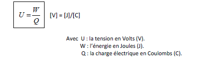

## Formule de la Quantité électrique exprimé en Coulomb [C] :

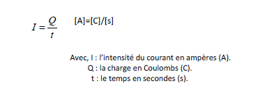

Cette formule est l’une des transformations possible si dans un exercice on vous demande de chercher Q avec un temps et une intensité Vous devez transformez la formule ci-dessous donc on obtiendra : Q = I\*t = [A]\*[s] = [C]

ATTENTION Si ON VOUS DONNE DES [A].[h] si vous faites X3600 VOUS RETOMBEZ EN COULOMB !!!!

## La formule de la résistivité électrique selon Pouillet (Donc sans coefficient de température) :

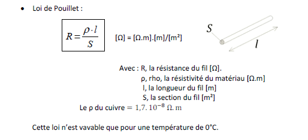

ATTENTION ERREUR COURANTE : Dans un exercice on peut vous donné une section d’un câble en mm, MAIS N’OUBLIER PAS QUE VOUS DEVEZ RETOMBER EN m², donc il va falloir calculer alors d’abord la conversion de mm -> en m puis convertir m² en calculant la surface du câble.

Loi d’ohm résistance pas confondre avec résistivité : R = U/I

## La formule de la résistivité selon Mathiessen (avec coefficient de température) :

## La Loi de Joule (Différentes formules de Puissances) :

ATTENTION ALERTE MOMENT RELOU : Dans le chapitre des puissances il y’a beaucoup de formules pour calculer les puissances, ces formules sont à choisir selon les valeurs données dans les exercices ou ça dépend aussi de ce que l’on cherche N’OUBLIEZ PAS QUE CHAQUE FORMULE PEUT NOUS AIDEZ A TROUVER DES AUTRES DONNEES : Exemple : le courant, le temps, La tension ou même la résistance ou même l’énergie Voici les formules des puissances : P=W/t -> En clair c’est l’énergie (Travail électrique [J] / le temps [s]) On aura une réponse exprimés en Watt [W] (LA PUISSANCE TOUJOURS EXPRIMER EN WATT).

### Les Formules de Joules :

P = U\*I -> [W]=[V]\*[A]

P = U²/R -> [W]= [V] ²/Ω

P = R\*I² -> [W]= [Ω]\*[A] ²

## L’Energie électrique :

Comme vous avez pu le remarquez les formules d’énergie ressemble a ceux des puissance..EFFECTIVEMENT pour calculer une énergie il suffit de ou transformer la première formules des puissances que je vous ai dit (P=W/t -> W=P\*t) Ceci vous donc dire que si on prend une puissance et qu’on multiplie avec une unité de temps alors nous obtenons une énergie exprimés en Joule…MAIS C’NE EST PAS BEAU L’ELECTRICITER !?

ATTENTION POUR LA NOTION DE TEMPS JE REPETE C’EST EN SECONDE CAR N’OUBLIER PAS LA RELATION [J]=[s] -> [W.h]=[Heure] donc nous multiplierons notre temps en seconde ATTENTION AU CONVERSION !!

## La Notion de rendement :

n = Pu/Pa

Pu = Puissance Mécaniques [W]
Pa = Puissance absorbée [W] (Pa=U\*I ou les autres formules montré avant)
N = Rendement s’exprime en [%]

## Les lois de KIRCHHOFF :

### La loi des nœuds :

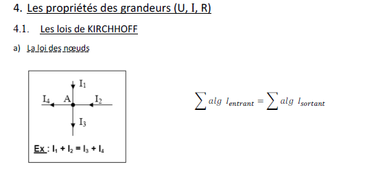

Un nœud est une jonction ou se rejoint plusieurs branche. La loi explique que la somme des courants entrants est équivalents a la somme des courants sortants ce qui est utile pour calculer un courant dont on ne connaît pas les valeurs dans un exercice.

#### La loi des Mailles :

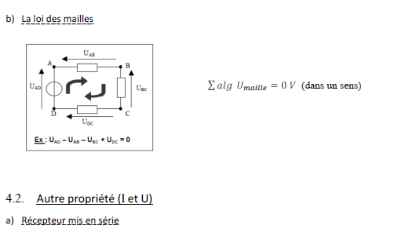

La loi des mailles dis que la somme des tension des mailles dans un circuit est égale à 0.

Mais comment ON FAIT !?

Déjà il va falloir déterminer le sens du courant électrique, quand ceci sera fait VOUS SAVEZ QUE LE COURANT S’OPPOSE A LA CAUSE QUI LUI A DONNE NAISSANCES alors vous dessinerais le sens de U dans le sens contraire de I, Puis prenez un sens horlogique ou anti-horlogique au choix normalement si votre equations est bonne dans les deux cas le résultat doit être 0 ce qui correspond a la loi des mailles.

## Les résistances équivalentes dans un circuit :

### Mise en série :

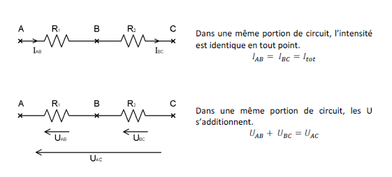

Req = R1+R2 -> On additionne les deux valeurs Ohmiques.

### Mise en parallèle :

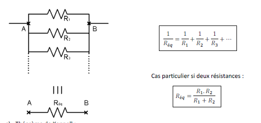

ATTENTION ASTUCES : si les valeurs des résistances sont les même ont peut diviser la valeur par le nombre de branche.

## Théorème de Kennelly :

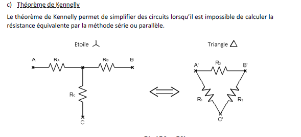

Comme vous pouvez le constatez la configuration étoile n’est pas utile pour calculer la Req : donc ceci est utilisé pour transformer en configuration triangle qui est plus facile pour calculer la Req. ATTENTION APRES LA CONFIGURATION EN TRIANGLE TERMINER NE PAS OUBLIER DE REPASSER CECI EN SCHEMA DE PRINCIPE POUR CALCULER.

## Pont diviseur de courants :

On va être clair sur deux choses :

- UN MULTIMETRE EN CALIBRE TENSION CE MESURE EN PARALLELE ET A UNE VALEUR OHMIQUE INTERNE GRANDE (10MΩ).
- UN MULTIMETRE EN CALIBRE COURANTS EN A CE MESURE EN SERIE ET CA RESISTANCES INTERNES ET PETITES.

C’est bon on peut commencer :D !!

### Pont diviseur de courant :

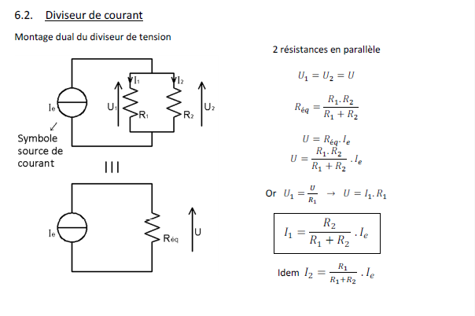

### Pont diviseur de tension continu :

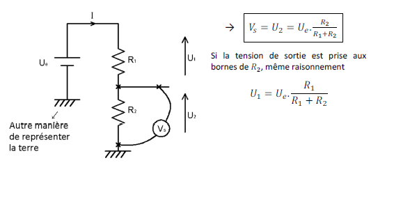

## Montage :

### Montage Aval :

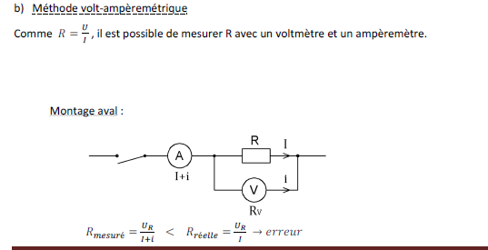

Ce montage est utilisé pour la mesure de petites résistances.

### Montage Amont :

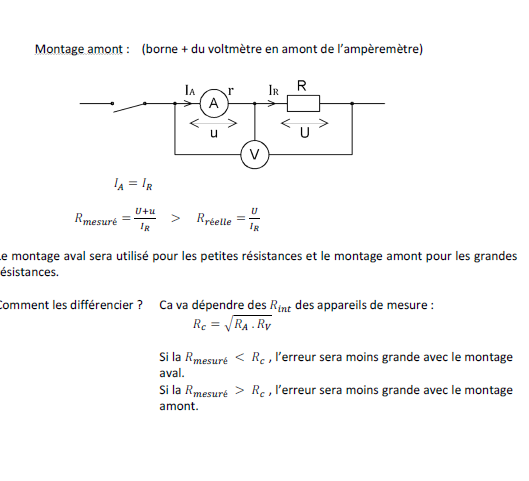

## La loi de Coulomb :

Le calcule d’une force électrostatique :

Deux formules :

-E = F/q -> E\*Q = F

Et la deuxième formule par rapport à une charge ponctuelle :

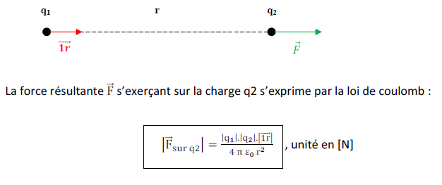

Etudions d’un peu plus près chaque membre de la formule :

Les q1 et q2 sont deux charges exprimés en coulomb le 1r ne vaut que 1(appelé vecteur a 1).
Le r² et la distances qui séparent ces deux charges.

Mais le E0 c’est quoi ?

ATTENTION ERREUR COURANTE DANS CE CHAPITRE :

### L’étude de la permittivité :

La permittivité de l’air (E0) ?

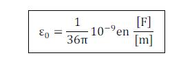

Vous avez donc une constante.

### Notion de permittivité relative :

Ceci dépend des matériaux utilisé et varie si on veut la « permittivité dite » nous devons faire alors :

E = E0\*ER

ATTENTION LA PERMITIVITTER VOUS AVEZ REMARQUE ELLE NE S’ECRIS PAS « E « MAIS LE SIGNE BIZARRE DANS LA FORMULE.

Le champ électrostatique ou magnétique :

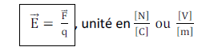

Relations a appliquée en exercice :

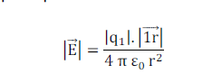

## Le condensateur :

La capacité d’un condensateur.

Par definition, la grandeur caracterisant un condensateur est liee a la difference de potentiel UAB et a la charge des armatures.

Première Formule :

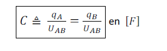

Deuxième Formule :

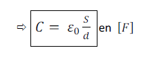

ATTENTION cette formule est à prendre compte que si il n’y a pas d’isolant entre les armatures.

Troisième Formule :

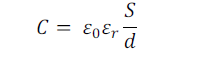

Si un isolant est pris en compte dans la formule.

### Les groupements de condensateur :

#### Mise en parallèle :

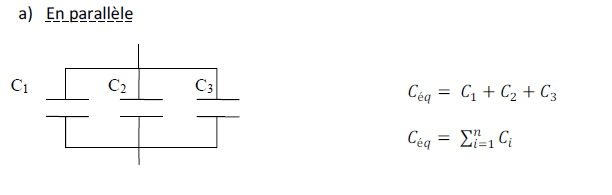

On fait avec les condensateurs tout l’inverse des résistances.

#### Mise en série :

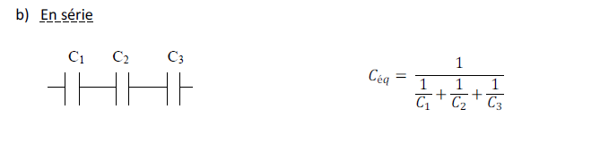

On procède comme si on avait des résistances en parallèle.

## L’énergie électrostatique :

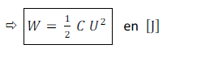

[J] = 1/2 \*[F]\*[V] ²
