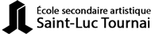

# Home

Hi!👋️ My name is Victor.
I'm a Computer Science Student.

## Projects


<ul>
<li><a href="{{ project.url | relative_url }}">{{ project.title }}</a></li>
</ul>


<ul class="projects finished">

    
        <li class="project">
            <h2>
                <a class="name" href="{{ project.url | relative_url }}">
                    {{ project.title }}
                </a>
            </h2>
            {{ project.excerpt }}
            
                <ul class="references">
                
                    <li><a href="{{reference}}">{{ reference }}</a></li>
                
                </ul>
            
        </li>
    

</ul>

## Experience

## Education

    

        

            

                
            

            

                

                    <h3 class="uk-card-title">University of Mons</h3>
                

                
Bachelor in Computer Science

                
2017 - 2020

            

        

    

    

        

            

                
            

            

                

                    <h3 class="uk-card-title">University of Montreal</h3>
                

                
Exchange at the Department of Computer Science and Operations Research

                
Autumn 2019

            

        

    

    

        

            

                
            

            

                

                    <h3 class="uk-card-title">University of Mons</h3>
                

                
Master in Computer Science

                
2020 - Present

            

        

    

